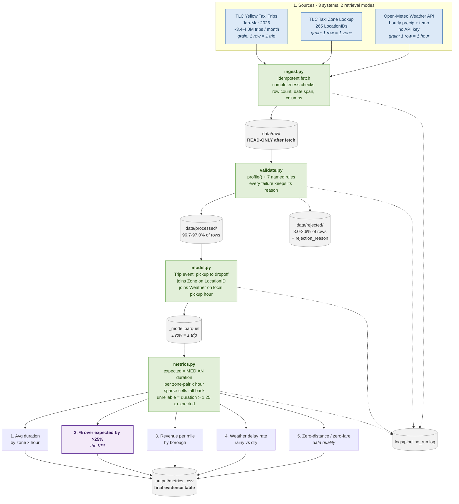
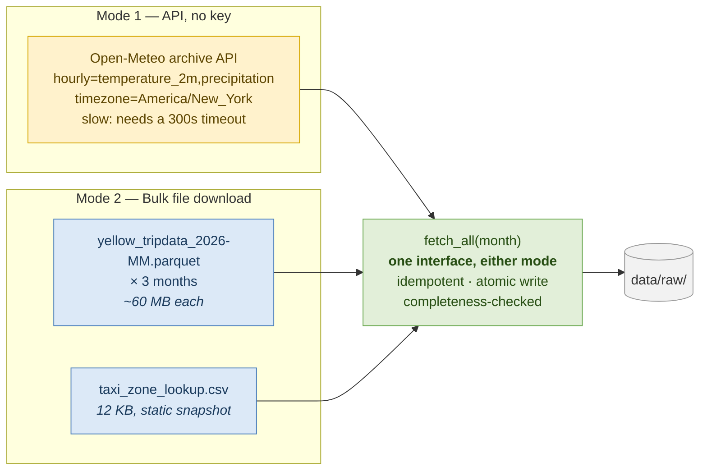
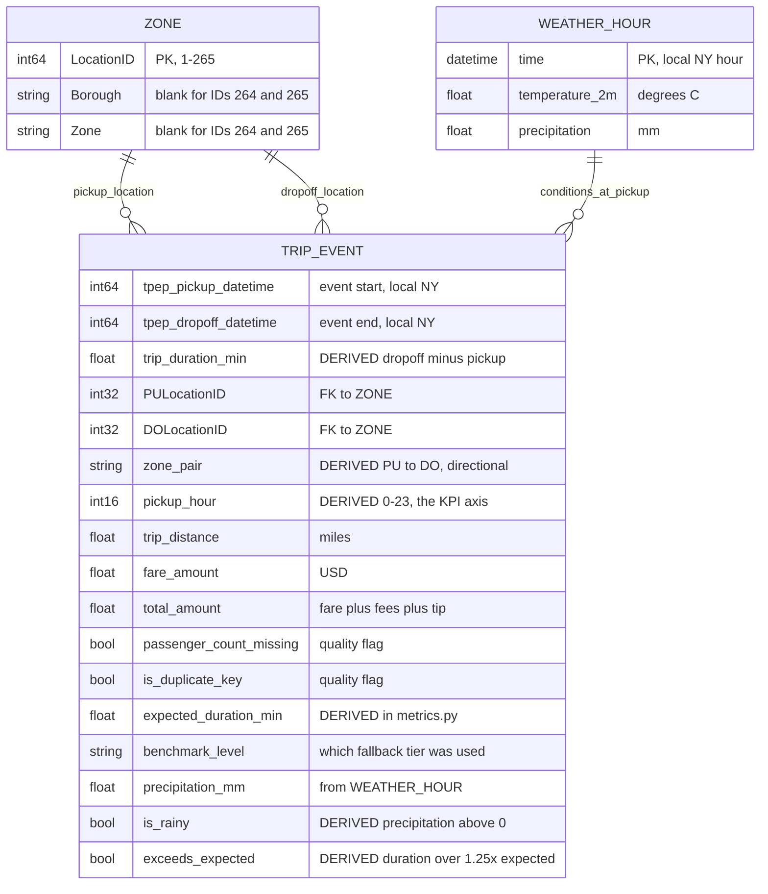
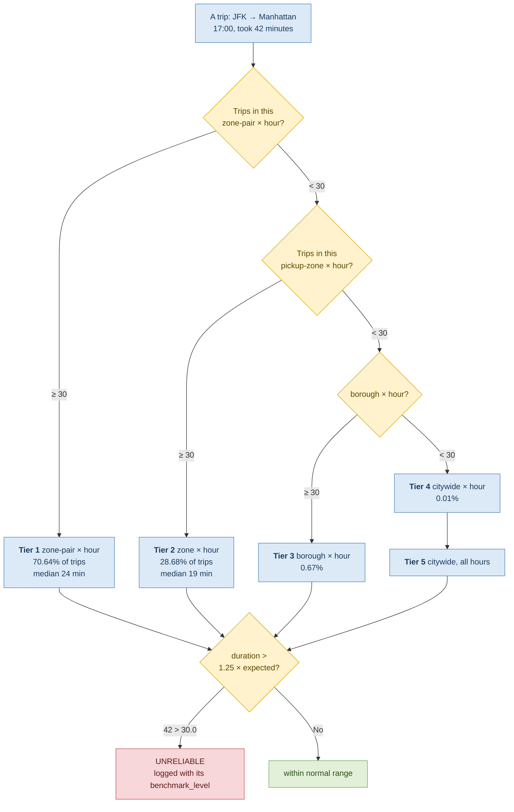

# NYC TLC Trip Duration Reliability Pipeline

> **Which zone-hours do NYC taxi trips run unreliably long, and is weather the reason?**
> A repeatable monthly metrics pipeline over TLC Yellow Taxi records, built for fleet operations.

[](https://www.python.org/)
[](https://pandas.pydata.org/)


| | |
|---|---|
| **Business KPI** | Trip duration reliability |
| **Stakeholders** | Fleet operations, TLC policy analyst |
| **Data** | TLC Yellow Taxi Jan-Mar 2026 (3.4-4.0M trips/month) + zone lookup + Open-Meteo weather |
| **Runtime** | ~18s per month with data cached; ~190 MB downloaded on first run |
| **Output** | `output/metrics_<month>.csv` - 5 operational metrics |
| **One command** | `python src/pipeline.py 2026-01 2026-02 2026-03` |

---

## Contents

| Section | What it covers | Graded area |
|---|---|---|
| [Problem Statement](#problem-statement) | What fleet ops cannot see today | - |
| [Stakeholders](#stakeholders) | Who uses the output and for what decision | - |
| [Business KPI & Decision](#business-kpis--decision) | The KPI and the decision it supports | - |
| [Pipeline at a Glance](#pipeline-at-a-glance) | Flow diagram of all four stages | Class 8 |
| [Source Overview](#source-overview) | Business questions mapped to sources and gaps | **Class 4** |
| [Data Model](#data-model) | Entity model: Trip, Zone, Weather | **Class 7** |
| [Setup & Usage](#setup--usage) | How to run it and what it produces | - |
| [Validation Rules](#validation-rules) | The seven business rules and their evidence | **Class 6** |
| [Metrics](#metrics) | The five operational metrics | **Class 7** |
| [The Expected-Duration Benchmark](#the-expected-duration-benchmark) | The core judgment call, in detail | **Class 7** |
| [Key Findings](#key-findings-janmar-2026) | What the data actually says | - |
| [Facts / Unknown / Assumptions / Bottlenecks](#facts--unknown--assumptions--bottlenecks) | Known, Unknown, Assumption and Limitation | **Submission** |
| [Demo](#demo-35-minutes) | A 3-5 minute talk track | Submission |
| [Project Structure](#project-structure) | Every file and what it does | - |

---

## Problem Statement

Fleet operations at NYC TLC lack visibility into where and when taxi trips take significantly longer than expected. Trip data is scattered across monthly bulk files with no linked zone context, no benchmark for "expected" duration, and no view of external factors like weather - so ops can't systematically identify which zone-hours need driver rebalancing or further investigation.
This project builds a repeatable monthly pipeline over TLC Yellow Taxi trip records (Jan–Mar 2026) that validates the raw data, models each trip as a pickup→dropoff event with zone and weather context, and produces 3–5 operational metrics answering: which zone-hours run unreliably long, and is weather a contributing factor?

**Why this is a data problem, not a code problem:** the hard part is not fetching rows or
computing averages. It is that *no source tells you what "expected" means*, the zone dimension
arrives as bare `LocationID` integers, and roughly 29% of the passenger data is missing
in a way that looks random but is not. Each of those is a judgment call, and the pipeline is
built to make them explicit and auditable rather than buried in a notebook.
---

## Stakeholders

| # | Stakeholder | Why They Matter | What I would ask them |
|---|-------------|-----------------|-----------------------|
| 1 | Fleet Operations | They own the driver supply and feel the cost of unreliable trip times directly | "Which zones do you suspect are problematic?" |
| 2 | TLC Policy Analyst | They decide whether delays are an operational issue or a systemic one, and what interventions (congestion policy, curb management) are warranted | "Do you need delays explained (weather? congestion?) or just flagged? And what report granularity do you operate on?" |

---

## Business KPIs & Decision

**Business KPI: Trip duration reliability** - for each zone and hour of the day, how often do trips take significantly longer than expected, and by how much?

**The decision this output supports:**

> Which **zone-hour combinations** need driver rebalancing or further investigation
> into pricing/routing issues - reviewed monthly by fleet operations.

**KPI definition:** "Expected" duration isn't provided by any source - it's derived as
the median duration for that zone-pair and hour-of-day (a judgment call, see Assumptions).

**Success criteria for the pipeline:** for any given month, one command reproduces the
full metric table from raw sources - validated inputs, rejected rows accounted for with
reasons, and identical output on re-runs.

---

## Pipeline at a Glance



**A note on the branch at `validate.py`.** Rejected rows are not discarded. They are written to `data/rejected/` with a `rejection_reason` column, and `len(clean) + len(rejected) == len(raw)` holds exactly for every month. That reconciliation is asserted in the notebook, because "we dropped some bad rows" and "we lost some rows without noticing" look identical in a log file.

The same source file is also available as a rendered diagram: [`diagrams/workflow_model.png`](diagrams/workflow_model.png) (editable source: `workflow_model.dot`).

---

## Source Overview

| # | Business Question | Data Needed | Owning Source | Source System / Access | Grain | Known Gaps & Limitations |
|---|-------------------|-------------|---------------|------------------------|-------|--------------------------|
| 1 | Which zone-hour combinations have trips running significantly longer than expected? | Pickup/dropoff timestamps, pickup/dropoff LocationID, trip distance, fare | NYC Taxi & Limousine Commission (TLC) | Yellow Taxi Trip Records - bulk Parquet download per month (`https://www.nyc.gov/site/tlc/about/tlc-trip-record-data.page`) | 1 row = 1 completed trip | No ground-truth "expected" duration (must be derived); timestamps occasionally invalid (dropoff before pickup); no traffic/congestion data to explain *why* trips are long |
| 2 | How does weather (rain/temperature) relate to trip delays? | Hourly precipitation and temperature for NYC | Open-Meteo | Historical Weather API - REST, no key required (`https://open-meteo.com/en/docs/historical-weather-api`) | 1 row = 1 hour, city-wide | City-wide aggregate, not route-specific - a trip from JFK to Manhattan experiences different conditions than "NYC average" implies; cannot capture localized events (e.g., a storm hitting only one borough) |
| 3 | Which boroughs/zones are affected (for rebalancing decisions)? | LocationID → Borough / Zone / service zone mapping | NYC TLC | Taxi Zone Lookup Table - CSV file linked from the same TLC page | 1 row = 1 LocationID (265 zones) | Lookup is static (snapshot at download time). Profiling found **zero** trip records with a LocationID missing from the lookup, so the join is currently complete; the rule is retained as a guard against future schema changes. Note that LocationID 264 is literally named "Unknown", so some trips map to a zone with no meaningful borough |

### Retrieval: two modes behind one interface



Both modes funnel through the same `fetch_all(month) -> dict[str, Path]`, so the rest of the pipeline never knows or cares which source came from where. Each fetch skips what already exists, writes atomically via a `.part` file, and runs a completeness check that is logged on every run.

> **One retrieval bug worth mentioning in the demo.** The first weather implementation requested `timezone=UTC` while TLC timestamps are recorded in local New York time, and justified it as "a one-hour offset, immaterial". It was wrong twice over: the offset is 4-5 hours, and it would have systematically attributed rain to the wrong trips. It was caught before any metric was computed, and all three weather files were re-fetched.

---

## Scope

**In scope:** Yellow Taxi trip records only, January-March 2026 (3 months - enough to
demonstrate a repeatable monthly pipeline without excessive volume).

**Out of scope:** Green Taxi, FHV, and HVFHV records - these are different fleets with
different schemas and are not needed for this KPI.

---

## Data Model

A flat event table, one row per completed trip. The assignment explicitly allows
this, and at 3.4-4.0M rows per month a warehouse would add cost without changing
the answer.



**Entities**

| Entity | Grain | Source | Key |
|---|---|---|---|
| **Trip** (the event) | 1 row = 1 completed pickup → dropoff | TLC Yellow Taxi parquet | none (row identity) |
| **Zone** (dimension) | 1 row = 1 taxi zone | TLC Taxi Zone Lookup | `LocationID` (1-265) |
| **Weather** (context) | 1 row = 1 hour, city-wide | Open-Meteo archive API | local hour timestamp |

**Joins**

- `Trip.PULocationID` and `Trip.DOLocationID` → `Zone.LocationID` (many-to-one).
  Profiling found **zero** unmatched IDs, so the join is complete; `validate.py`
  keeps the rule as a guard against a future schema change.
- `Trip` pickup hour → `Weather` hour, after flooring the pickup timestamp to the
  hour. **Both sides are local New York time**, so this is a direct lookup with no
  timezone conversion. (An earlier draft fetched weather in UTC against local TLC
  timestamps, which was a systematic 4-5 hour misalignment; see
  [Assumptions](#assumptions-judgment-calls-we-made-and-why).)
- Trips whose pickup hour has no weather row are **flagged, not dropped**
  (4 trips in Jan 2026). They are excluded from metric 4 only, since they cannot
  be classified as rainy or dry.

**Derived fields**

| Field | Derivation | Used by |
|---|---|---|
| `trip_duration_min` | dropoff − pickup, in minutes | metrics 1-4, benchmark |
| `pickup_hour` | hour of day (0-23) of the local pickup | metrics 1, 2, 4, benchmark |
| `zone_pair` | `"PU->DO"`, **directional** | benchmark (JFK→Manhattan ≠ Manhattan→JFK) |
| `pickup_borough` | joined from Zone | metrics 3, 4, fallbacks |
| `is_rainy` | `precipitation_mm > 0` at the pickup hour | metric 4 |
| `expected_duration_min` | median benchmark with fallback chain | metrics 2, 4 |
| `exceeds_expected` | `trip_duration_min > 1.25 × expected_duration_min` | metrics 2, 4 (one shared flag) |
| `benchmark_level` | which tier the benchmark came from | auditability |

---

## Setup & Usage

**Requirements:** Python 3.12 with `pandas`, `pyarrow` and `requests`
(`pip install -r requirements.txt`). A full run downloads ~190 MB of TLC data;
with the data already fetched, a month takes **~18 seconds** end to end.

### Run everything (recommended)

```bash
python src/pipeline.py 2026-01                      # one month
python src/pipeline.py 2026-01 2026-02 2026-03      # all three months
```

`pipeline.py` runs ingest → validate → model → metrics, logging each stage to
both the console and `logs/pipeline_run.log`. It exits non-zero if any month
fails, and every stage overwrites its outputs, so re-running is safe.

### Run stage by stage (each is independently runnable)

```bash
python src/ingest.py 2026-01        # 1. fetch sources into data/raw/
python src/validate.py 2026-01      # 2. profile + rules -> processed/ + rejected/
python src/model.py 2026-01         # 3. build the trip/zone/weather event model
python src/metrics.py 2026-01       # 4. compute the five metrics
```

### Explore the data

Open `notebooks/exploration.ipynb` (already executed, outputs stored) for the
profiling evidence behind every validation rule and judgment call.

### Outputs

| Path | Contents |
|---|---|
| `data/raw/yellow_tripdata_<month>.parquet` | Untouched TLC download, read-only after ingest |
| `data/raw/weather_<month>.csv` | Hourly Open-Meteo data, local New York time |
| `data/raw/taxi_zone_lookup.csv` | Zone lookup (static, fetched once) |
| `data/processed/<month>_clean.parquet` | Rows passing all rules, plus quality flags |
| `data/processed/<month>_model.parquet` | Event model: 1 row per trip, zone + weather joined |
| `data/rejected/<month>_rejected.csv` | Every rejected row with a `rejection_reason` column |
| `output/metrics_<month>.csv` | **Final evidence table** (all 5 metrics, combined) |
| `output/metrics_<month>_<metric>.csv` | One CSV per metric, for readable per-metric views |
| `logs/pipeline_run.log` | Stage timings, row counts in/out, rule violations, errors |
| `diagrams/workflow_model.png` | Source map + workflow/data model diagram |

> `data/raw/`, `data/processed/` and `data/rejected/` are git-ignored because they
> are large and fully reproducible from the commands above. `output/` **is**
> committed, since the evidence tables are the deliverable.

### Verified behaviour

| Property | How it was verified |
|---|---|
| Idempotent reruns | Re-ran 2026-01: output CSVs byte-identical (md5 match), rejected row count unchanged (no appended duplicates) |
| Failure handling | Replaced a raw parquet with a corrupt file: run halted with a named `SourceMissingError`, a clear log line and exit code 1. No traceback, no partial output |
| Row reconciliation | `len(clean) + len(rejected) == len(raw)` for every month, asserted in the notebook |
| Runtime | 18.4s (Jan), 15.5s (Feb), 17.9s (Mar) with data already local |
---

## Validation Rules

Seven named rules, each a single constant or mask in `src/validate.py`, each
justified by evidence reproduced in `notebooks/exploration.ipynb`. Every rejected
row is written to `data/rejected/<month>_rejected.csv` with **all** the reasons it
failed, semicolon-joined. Nothing is silently fixed or dropped.

| Rule | Threshold | Jan 2026 violations | Basis |
|---|---|---|---|
| `invalid_duration` | 1 min ≤ duration ≤ 240 min | 85,290 | Assignment says `> 0`; tightened to 1 min because 45,069 rows have pickup == dropoff *while reporting non-zero distance* |
| `negative_fare` | `fare_amount >= 0` | 39,463 | Assignment rule; negatives are refunds and disputes |
| `implausible_distance` | `trip_distance <= 100 mi` | 162 | 162-172 rows/month, max in the hundreds of thousands of miles; would wreck revenue-per-mile |
| `unknown_pickup_zone` | ID present in the lookup | 0 | Assignment rule, retained as a guard |
| `unknown_dropoff_zone` | ID present in the lookup | 0 | Assignment rule, retained as a guard |
| `invalid_passenger_count` | 1-6, **only when populated** | 14,794 | ~29% of rows are null (a partial upstream feed); a populated 0 or 7-9 is still rejected |
| `pickup_outside_month` | month ± 1 day | 1 | Boundary spillover is real TLC behavior; a 2008 timestamp is not |

**Deliberately not rejected**

| Rows | Why kept |
|---|---|
| Zero-fare trips (~2,100/month) | They are the subject of metric 5 |
| Zero-distance trips (~125,700/month) | Same: metric 5 exists to measure them |
| Null `passenger_count` (~1,088,000/month) | Missing metadata, not a bad trip. No metric uses the field |
| Duplicate-key rows (~35,700/month) | Shared (pickup, dropoff, zone-pair) keys carry *different* fares and distances, i.e. genuinely distinct trips. Flagged as `is_duplicate_key` instead |

**Reconciliation:** `len(clean) + len(rejected) == len(raw)` holds exactly for
every month (Jan 3,590,046 + 134,843 = 3,724,889). This is asserted in the
notebook, because "we rejected some bad rows" and "we lost some rows without
noticing" look identical in a log file.

---

## Metrics

Five operational metrics, all computed per month by the pipeline:

### 1. Average trip duration by zone × hour-of-day
- **Definition:** Mean trip duration (minutes) for each pickup zone and pickup hour (0-23).
- **Grain:** zone × hour → up to 265 × 24 rows/month.
- **Serves:** Fleet ops: the "where and when" heatmap of slow trips.
- **Note:** Small-sample zone-hours are flagged (or excluded); a zone-hour with 2 trips
  has an unreliable average. Threshold documented in code.

### 2. % of trips exceeding expected duration by >25%
- **Definition:** Share of trips where `duration > 1.25 × expected_duration`, where
  **expected duration = median duration for that zone-pair and hour-of-day**.
- **Grain:** trip-level flag, aggregated by zone × hour.
- **Serves:** Fleet ops: the core reliability signal; this IS the KPI.
- **Judgment calls:**
  - *Median* (not mean) as "expected": robust to the very outliers we're detecting.
  - *Zone-pair × hour*: captures directional effects (JFK→Manhattan ≠ Manhattan→JFK).
  - *Fallback:* if a zone-pair/hour has too few trips for a stable median, fall back to
    pickup-zone × hour median, then borough × hour. Fallback chain documented in code.
  - *25% threshold:* stakeholder-informed (see Assumptions); deliberately not 50%+
    so moderate overruns are caught early.

### 3. Revenue per mile by borough
- **Definition:** Total fare-based revenue ÷ total trip distance, by pickup borough.
- **Grain:** borough → 5-7 rows/month (plus "Unknown" for missing LocationIDs).
- **Serves:** TLC policy analyst: are certain boroughs structurally poor value,
  suggesting pricing/routing issues rather than congestion?

### 4. Weather-adjusted delay rate
- **Definition:** Delay rate (% of trips exceeding expected duration by >25%, same
  definition as metric 2) on **rainy hours vs. dry hours**. A trip is "rainy"
  if hourly precipitation at its pickup hour > 0.
- **Grain:** comparison of two delay rates per month (plus per-zone breakdown).
- **Serves:** TLC policy analyst: distinguishes *weather-driven* delays (nobody's
  fault) from *operationally actionable* ones.
- **Judgment call:** rain is binary (precipitation > 0) rather than by intensity:
  simple, defensible, and easy to refine later.

### 5. Zero-distance / zero-fare trip rate
- **Definition:** % of trips with `trip_distance = 0` OR `fare_amount <= 0`.
- **Grain:** monthly rate (plus breakdown by reason).
- **Serves:** both: doubles as a **data-quality metric**. A rising zero-fare rate may
  mean cancelled trips, disputes, or upstream data problems; it bounds how much we
  trust metrics 1–4.

All metric definitions and thresholds are implemented in `src/metrics.py`.

---

## The Expected-Duration Benchmark

This is the judgment call the whole KPI rests on, so it gets its own section.

**No source provides ground-truth expected trip duration.** It has to be derived,
and the choice changes the answer:

```
expected_duration = MEDIAN trip duration for that zone-pair and hour-of-day
unreliable        = trip_duration > 1.25 x expected_duration
```

**Why the median, not the mean.** The mean is inflated by exactly the long trips
this metric is trying to detect. The median is robust to them.

**Why a fallback chain is necessary.** The zone-pair × hour grid is extremely
sparse. Profiling 2026-01:

| Cell size (zone-pair × hour) | Share of cells | Trips covered |
|---|---|---|
| fewer than 5 trips | 70.5% | 9.7% |
| fewer than 10 trips | 81.5% | 15.6% |
| fewer than 30 trips | 91.2% | 29.4% |
| **median cell holds** | **2 trips** | |

A median built from 2 trips is noise. So cells with fewer than `MIN_CELL_TRIPS`
(= 30) fall back through progressively coarser tiers:



Every trip records which tier produced its benchmark in `benchmark_level`, so the
fallback is auditable rather than invisible. In practice 70.6% of trips get a
zone-pair benchmark and 99.3% get zone-or-better.

**Where the trips actually land** (Jan 2026):

| Benchmark tier | Share of trips |
|---|---|
| zone-pair × hour (most specific) | 70.6% |
| pickup-zone × hour | 28.7% |
| pickup-borough × hour | 0.7% |
| citywide × hour | 0.01% |
| **zone-or-better (combined)** | **99.3%** |

Every trip records which tier produced its benchmark in `benchmark_level`, so
the fallback is auditable rather than invisible. A stakeholder can filter to
`benchmark_level == "zone_pair_hour"` and see only the strongest claims.

**The uncomfortable part, stated plainly.** The headline delay rate is **32.77%**,
and that number is **mostly arithmetic, not a finding**. Because the benchmark is
a *median* and trip durations are right-skewed, roughly a third of trips exceed
1.25× the median *by construction* (verified: 37.1% of trips exceed 1.25× the
citywide median). The absolute rate therefore carries little information.

The metric earns its keep as a **relative ranking between zone-hours**, not as an
absolute share of bad trips. Read it as *"Central Harlem at 16:00 and 17:00 tops
the list in both January and February"*, never as *"a third of trips are broken."*
This is why `metrics.py` sorts decision-grade cells (≥30 trips) to the top: sorting
on delay rate alone surfaces 1-trip cells that are trivially 0% or 100%.

**Two further limits of this approach**, both recorded in
[Bottlenecks](#bottlenecks--limitations-what-this-analysis-cannot-do):

1. The benchmark is **self-referential** in small cells: a trip contributes to the
   median it must beat, raising its own bar.
2. A **uniform** slowdown in a zone is invisible, because the median moves with it.
   That is why metric 1 (raw averages) ships alongside metric 2 rather than
   instead of it.

---

## Key Findings (Jan–Mar 2026)

Produced by `output/metrics_<month>.csv`. Every figure below is reproducible with
`python src/pipeline.py 2026-01 2026-02 2026-03`.

**Metric 1 + 2: where and when trips overrun their benchmark**

The worst *decision-grade* zone-hours (cells with at least 30 trips) are stable
across all three months, which is what makes them worth acting on:

| Month | Worst zone-hour | Trips | Delay rate | Avg vs expected |
|---|---|---|---|---|
| 2026-01 | Central Harlem, 16:00 | 1,024 | 51.6% | 23.8 min vs 16.6 min |
| 2026-02 | Central Harlem, 17:00 | 1,298 | 50.8% | 20.5 min vs 14.8 min |
| 2026-03 | South Ozone Park, 16:00 | 91 | 59.3% | 33.4 min vs 19.8 min |

Outer-borough zones (South Ozone Park, Jackson Heights) and Harlem zones during
the afternoon/evening peak dominate the tail. Read these as a **relative
ranking**: see the interpretation note under Bottlenecks.

**Metric 3: revenue per mile by borough** (Jan 2026): the spread is wide, not narrow:
EWR $16.40/mi, Manhattan $10.46, Brooklyn $6.40, Staten Island $5.97, Queens $5.82,
Bronx $4.77. Two caveats matter before anyone acts on this. EWR's figure rests on
**30 trips** (vs 3.07M for Manhattan), so it is not comparable; and the ordering
tracks trip length almost perfectly: Manhattan averages 14.8 min, the Bronx
36.7 min, so this is a **mix effect** (short airport runs earn high revenue per
mile), not evidence that any borough is mispriced. The output includes a `trips`
column precisely so this kind of small-denominator trap is visible.

**Metric 4: weather-adjusted delay rate** (Jan 2026): rainy hours 29.2% delayed
(365,565 trips) vs dry hours 33.2% (3,224,477 trips), a **-4.0pp** difference in
the *opposite* direction to the naive expectation. Rain does not explain delays
here; the delay problem is operational, not weather-driven. Caveat worth stating:
rainy hours also average colder (1.4C vs -2.6C) and shorter trips (16.0 vs
17.4 min), so this is an association across different trip mixes, not a controlled
comparison. It is still a useful negative result: it tells the policy analyst not
to attribute unreliability to weather.

**Metric 5: data quality** (Jan 2026): 2.73% zero-distance trips, 0.04%
zero-fare, 30.22% missing `passenger_count` (the partial-feed block). The
first two are the subject of the metric; the third is the caveat on everything else.

---

## Demo (3–5 minutes)

The talk track below centres on **one FDE judgment call** (marked ★), because the
brief asks for one important judgment to be explained rather than a full tour.

**0:00: The question (20s).** Fleet ops can't see *where* or *when* taxi trips run
significantly longer than expected. No source provides "expected" duration, no
traffic data exists, and the zone information is a bare LocationID. The job was to
turn three fragmented sources into one monthly table that answers it.

**0:20: Run it live (60s).** In the repo root:

```bash
python src/pipeline.py 2026-01 2026-02 2026-03
```

Point out as it runs: it fetches ~190 MB on a cold start, takes ~18s per month when
the data is local, and logs every stage. Show that re-running is safe, and mention
the corrupt-file test (halt with a named error, exit 1, no partial output).

**1:20: Walk the pipeline (40s).** Three sources, two retrieval modes → `ingest.py`
(idempotent, with completeness checks) → `validate.py` (7 named rules, every
rejected row keeps its reason) → `model.py` (one row per trip, joined to zone and
weather) → `metrics.py` (five metrics). Refer to `diagrams/workflow_model.png`.

**★ 2:00: The judgment call: what counts as "expected"? (90s).**

*No source supplies expected trip duration, so I had to derive it, and the choice
changes the answer.* I use the **median duration for that zone-pair and hour**.

- **Why median, not mean:** the mean gets pulled up by exactly the long trips I'm
  trying to detect. The median is robust to them.
- **Why the fallback chain exists:** I profiled the grid first. 70.5% of the
  ~299,000 zone-pair × hour cells hold fewer than 5 trips, and the median cell holds
  2. A median built from 2 trips is noise. So cells under 30 trips fall back:
  zone-pair → zone → borough → citywide. Every trip records which tier it used, so
  you can audit it. 70.6% of trips get a zone-pair benchmark; 99.3% get zone-or-better.
- **The uncomfortable part:** the headline delay rate is 32.77%, and that number is
  **mostly arithmetic, not a finding**. With a median benchmark and right-skewed
  durations, about a third of trips exceed 1.25× the median by construction: I
  checked, 37.1% exceed 1.25× the citywide median. So I've documented metric 2 as a
  **relative ranking between zone-hours**, not an absolute share of bad trips. The
  useful output is *"Central Harlem at 16:00 and 17:00 tops the list in both January
  and February"*: not *"a third of trips are broken."*

**3:30: The finding (40s).** The worst decision-grade zone-hours are stable across
all three months: Central Harlem 16:00–17:00 and East Harlem South in Jan/Feb,
South Ozone Park and Jackson Heights in Mar. And metric 4 is a useful *negative*
result: rainy hours are delayed **less** often than dry hours (-4.0pp), so weather
doesn't explain the unreliability. That redirects the investigation to operations
rather than weather.

**4:10: Limits I know about (30s).** Say these out loud; naming them is the point.
- The benchmark is self-referential: a trip in a small cell helps set the median it
  must beat.
- A *uniform* slowdown in a zone is invisible to metric 2, because the median moves
  with it. That's why metric 1's averages ship alongside it.
- Revenue-per-mile looks wide, but EWR's $16.40/mi rests on **30 trips**, and the
  ordering mostly tracks trip length. It's a mix effect, not mispricing.
- ~29% of rows have a missing `passenger_count` (a partial upstream feed). No metric
  uses that field, so I kept those trips and flagged them, rather than discarding a
  million real rows a month over a field we never read.

**4:40: Close (20s).** One command reproduces every number above from raw inputs,
and the judgment calls are written down in the README, the code comments, and the
notebook, so a reviewer can disagree with any of them and see exactly what would
change.

---

## Facts / Unknown / Assumptions / Bottlenecks

### Facts (verified against the data or sources, via `ingest.py` completeness checks)
- TLC Yellow Taxi records for Jan–Mar 2026 contain **3.4-4.0M trips per month**
  (Jan: 3,724,889; Feb: 3,399,866; Mar: 3,952,451), released as monthly Parquet
  files with a stable, documented schema.
- The Taxi Zone Lookup Table has 265 LocationIDs and is a static snapshot; it does
  not change month to month.
- Open-Meteo provides hourly precipitation and temperature for NYC with no API key,
  and returned a complete hourly series for Jan–Mar 2026 (744/672/744 hourly rows,
  exactly 24 per day, no missing hours).
- Trip duration is not a column in the data: it must be computed as
  dropoff_datetime minus pickup_datetime.
- Monthly TLC files contain a small number of pickup records outside the calendar
  month (a few minutes before/after the boundary), which is normal TLC behavior.
- The March file contains two implausibly old records (pickup timestamps
  2009-01-01 and 2008-12-31), genuine upstream data errors; validation catches and
  rejects them via `pickup_outside_month` rather than passing them through.
- **~29% of trips have a null `passenger_count`** (Jan: 1,088,058 of 3,724,889). The
  nulls are not random: they form one contiguous block at the tail of each monthly
  file, and the *exact same* rows have null `RatecodeID`, `store_and_fwd_flag`,
  `congestion_surcharge`, `Airport_fee` and `payment_type == 0`. This is a partial
  upstream feed, not missing-at-random data. The block's trips are otherwise normal
  (median duration 16.0 min, median fare $22.21, spanning the full month).
- The raw files contain **zero full-row duplicates**. Tens of thousands of rows share
  the (pickup, dropoff, pickup-zone, dropoff-zone) key, but with differing distances
  and fares, i.e. genuinely distinct trips that coincided to the second.
- After validation, 96.7-97.0% of rows survive per month (Jan: 3,590,046 valid /
  134,843 rejected; Feb: 3,288,955 / 110,911; Mar: 3,831,806 / 120,645). Clean +
  rejected reconciles exactly to the raw row count, so nothing is silently dropped.

### Unknown (what these three sources cannot tell us)
- **Why ~29% of `passenger_count` is null.** The block is clearly one partial
  upstream feed, but nothing in the data distinguishes a vendor contract gap from a
  TLC export bug. Settling it requires asking TLC, not querying the files.
- **Whether rows sharing a (pickup, dropoff, zone-pair) key are distinct trips or
  double-keyed records.** They carry different distances and fares, which is
  consistent with distinct trips, but the source exposes no trip identifier that
  would settle it. We therefore flag rather than deduplicate.
- **Why two March trips are stamped 2009 and 2008** (`PULocationID` 48, one with a
  16.9-mile distance). A keying error and a corrupted record both fit; neither row
  carries a field that distinguishes them. Both are rejected by
  `pickup_outside_month` and logged.
- **What actually causes the delays.** No traffic or congestion source was in
  scope, so "this trip ran long" is observable but its cause is not inferable from
  these three sources. Metric 4 narrows it (weather is not the driver) without
  identifying the real one.
- **Whether any individual driver is affected.** The data is trip-level with no
  driver identifier, so a pattern caused by a small set of drivers is
  indistinguishable from a zone-wide one.
- **Whether the 2026 files reflect a permanent schema or a temporary one.** The
  extra fee columns present in 2026 were absent in earlier years, and nothing in
  the files says whether they are permanent.

### Assumptions (judgment calls we made, and why)
- **"Expected" duration is the median per zone-pair and hour-of-day.** No source
  provides ground-truth expected durations. Median is chosen over mean because it is
  robust to the very outliers we are trying to detect.
- **A trip is "unreliable" if it exceeds expected duration by more than 25%.**
  Threshold informed by what fleet ops would act on; moderate overruns are caught
  early, extreme ones are caught by metric 1 anyway.
- **Sparse zone-pair/hour cells fall back** to pickup-zone × hour median, then
  borough × hour, then citywide × hour. Without a fallback, rare zone-pairs would
  have no usable benchmark.
- **"Rainy" means hourly precipitation > 0 at pickup.** Binary rather than
  intensity-based: simple and defensible; can be refined later.
- **A missing `passenger_count` does not invalidate a trip; a populated value outside
  1–6 does.** The assignment's example rule reads "passenger count between 1 and 6",
  but applying it literally would reject the ~29% null block described above and
  discard roughly a million real trips per month. No metric uses passenger count, so
  the cost of that rejection is high and the benefit is zero. Rows with a *populated*
  value of 0 or 7–9 (~14.8k/month) are still rejected, and the missing ones are
  carried through as a `passenger_count_missing` flag for the data-quality view.
- **Minimum trip duration is 1 minute, not > 0.** 45,069 rows have pickup == dropoff
  to the second *while reporting a non-zero distance*, and ~31,000 more last between
  1 and 30 seconds. A trip cannot cover ground in zero seconds, so these are timestamp
  artifacts that would corrupt the duration KPI. The bound is a single named constant
  (`MIN_DURATION_MIN`) in `src/validate.py`.
- **Trips over 100 miles are rejected as data-entry errors.** 162-172 rows per month
  exceed 100 miles, with maxima in the hundreds of thousands of miles. Genuine long
  runs (JFK ↔ Manhattan) are ~30–35 miles, so the cap is generous; without it these
  rows would badly distort revenue-per-mile (metric 3).
- **Zero-fare and zero-distance trips are kept, not rejected.** They are the subject
  of metric 5, so they are evidence rather than error. Only *negative* fares (refunds
  and disputes) are rejected.
- **Rows sharing a (pickup, dropoff, zone-pair) key are kept and flagged, not
  deduplicated.** See the Facts entry above: the shared keys carry different fares and
  distances, so removing them would risk deleting real trips. The
  `is_duplicate_key` flag surfaces them in the data-quality view instead.

### Bottlenecks / Limitations (what this analysis cannot do)
- **No ground truth for "expected":** the benchmark is derived from the same data it
  judges, so it can only ever rank zones against *each other*, never against an
  absolute standard of "acceptable".
- **A systemic slowdown is therefore invisible to metric 2.** If every trip in a zone
  gets 30% slower, the median moves with it and the delay rate stays flat. Metric 1's
  averages are the only view that surfaces this, which is why metric 1 is reported
  alongside metric 2 rather than instead of it.
- **No traffic or congestion data:** we can flag that trips are slow, but not why
  (congestion, construction, closures). Weather is our only external explanatory factor.
- **Weather is city-wide, not route-specific:** a JFK→Manhattan trip in a localized
  storm is matched against the citywide hourly value.
- **No driver-level data:** driver behavior, experience, and shift patterns are
  invisible; two trips on the same route/hour can differ for reasons we cannot see.
- **Yellow fleet only:** findings do not generalize to Green, FHV, or HVFHV fleets
  (different operations, different schemas).
- **Completed trips only:** the TLC data records completed trips. Trips abandoned
  mid-journey (arguably the worst reliability failures) are absent by construction.
- **Small samples:** zone-pairs with few trips per hour have noisy medians even with
  the fallback chain; those rows are flagged, not silently trusted.
- **Metric 2 is a relative ranking, not an absolute failure rate.** Because the
  benchmark is a *median* and trip durations are right-skewed, roughly a third of
  trips exceed 1.25× their benchmark **by construction**: verified on 2026-01:
  32.77% of trips are flagged overall, and 37.1% of trips exceed 1.25× the
  citywide median. The absolute number therefore says little; the metric earns its
  keep by *ranking* zone-hours against each other. A stakeholder who reads
  "32.77% unreliable" as "a third of trips are broken" would be misreading it, so
  this is stated in the code, the diagram and here.
- **The benchmark is partly self-referential.** A trip in a small cell contributes
  to the median it is compared against, so its own duration raises the bar it must
  clear. This is why cells under 30 trips fall back to coarser tiers, and why
  `benchmark_sample_size` is retained on every trip.

---

## Project Structure

```
nyc-tlc-fde/
├── README.md                     this document
├── requirements.txt              pandas, pyarrow, requests
├── data/
│   ├── raw/                      untouched downloads, READ-ONLY after ingest (git-ignored)
│   │   ├── yellow_tripdata_<month>.parquet
│   │   ├── weather_<month>.csv
│   │   └── taxi_zone_lookup.csv
│   ├── processed/                git-ignored, regenerated by validate.py / model.py
│   │   ├── <month>_clean.parquet
│   │   └── <month>_model.parquet
│   └── rejected/                 git-ignored, <month>_rejected.csv + rejection_reason
├── src/
│   ├── ingest.py                 Stage 1: idempotent fetch + completeness checks
│   ├── validate.py               Stage 2: profile() + 7 business rules, clean/rejected split
│   ├── model.py                  Stage 3: trip/zone/weather event model
│   ├── metrics.py                Stage 4: expected-duration benchmark + 5 metrics
│   └── pipeline.py               Stage 5: orchestrator, logging, failure handling
├── notebooks/
│   └── exploration.ipynb         executed EDA documenting every rule and judgment call
├── diagrams/
│   ├── workflow_model.png        rendered source map + data model
│   ├── workflow_model.svg        scalable version
│   └── workflow_model.dot        editable Graphviz source
├── output/                       committed: the final evidence tables
│   ├── metrics_<month>.csv       all 5 metrics combined
│   └── metrics_<month>_<metric>.csv
└── logs/
    └── pipeline_run.log          committed run evidence: timings, counts, errors
```

**Stage boundaries are real.** `model.py` recomputes `trip_duration_min` rather
than reading it from `validate.py`, and `metrics.py` attaches the benchmark once
so metrics 2 and 4 read the same `exceeds_expected` flag and cannot disagree.
Each stage can be run and inspected on its own, and the notebook imports
`validate.profile` so the notebook and the pipeline can never disagree about what
"profiled" means.
