# FlashEats Classroom Pack — FDE Investigation Series

> **Client escalation:** *"Late deliveries are increasing and customers say our ETA is unreliable. Figure out what is happening before we invest in a new AI delay-prediction system."*

A hands-on **Forward Deployed Engineer (FDE)** classroom series set inside a fictional food-delivery company, **FlashEats**. Students work like real FDEs across three classes: **retrieve messy multi-source data, validate whether it can support a decision, model the business workflow** and recommend what to do next.

    

---

## Table of Contents

- [The Story in 30 Seconds](#the-story-in-30-seconds)
- [Repository Map](#repository-map)
- [System Architecture](#system-architecture)
- [Data Landscape](#data-landscape)
- [Class Journey](#class-journey)
- [Quickstart](#quickstart)
- [Notebooks](#notebooks)
- [Mock Dispatch API](#mock-dispatch-api)
- [Key Findings](#key-findings-completed-solutions)
- [Validation Gate](#validation-gate-class-6)
- [Business Workflow Model](#business-workflow-model-class-7)
- [Order Lifecycle](#order-lifecycle)
- [Decision Logic](#decision-logic)
- [Known Data Quirks](#known-data-quirks)
- [Tech Stack](#tech-stack)
- [Contributing and Classroom Use](#contributing-and-classroom-use)
- [License / Attribution](#license--attribution)

---

## The Story in 30 Seconds

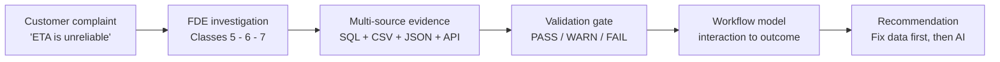

Leadership wants a **"56% late"** headline and an **AI delay predictor**. The data says: *not yet*. This repo contains everything needed to prove that rigorously — and to show what to instrument next.

---

## Repository Map

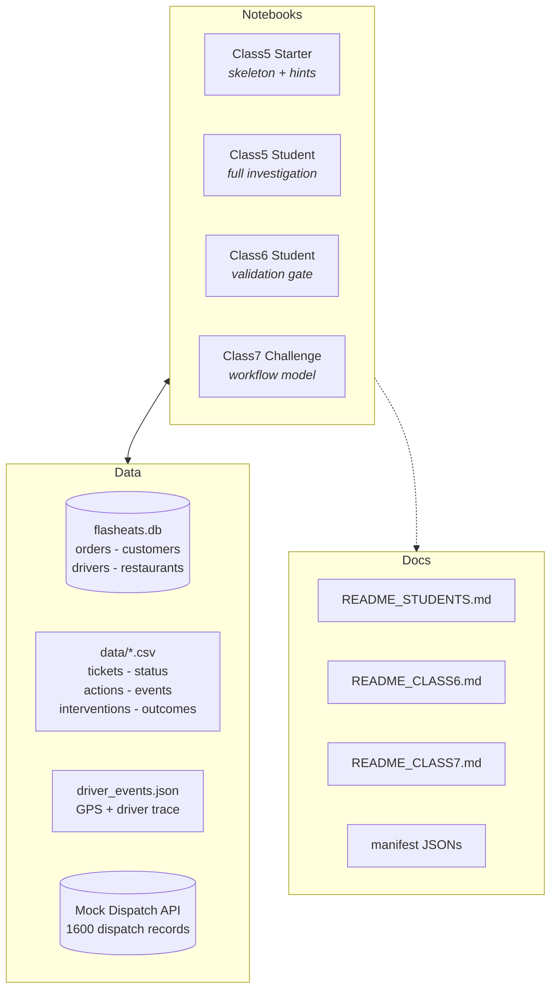

### File inventory

| Path | What it is |
|---|---|
| `FlashEats_Class5_Starter.ipynb` | Class 5 skeleton — challenge prompts with starter code (18 cells) |
| `FlashEats_Class5_Student.ipynb` | Class 5 completed investigation — all 5 challenges solved (20 cells) |
| `FlashEats_Class6_Student.ipynb` | Class 6 completed validation — 6 challenges + PASS/WARN/FAIL gate (21 cells) |
| `FlashEats_Class7_Challenge.ipynb` | Class 7 completed workflow model — 6 challenges + KPI linkage (15 cells) |
| `database/flasheats.db` | SQLite — `orders` (1603 rows), `customers` (900), `drivers` (120), `restaurants` (60) |
| `data/support_tickets.csv` | 202 customer complaint tickets (category + free text) |
| `data/restaurant_status.csv` | 502 per-order restaurant state updates |
| `data/driver_events.json` | 120 drivers — assigned / gps_ping / picked_up / delivered traces |
| `data/customer_app_actions.csv` | 2365 app actions (ETA_VIEWED / SUPPORT_OPENED / CANCEL_ATTEMPTED) |
| `data/order_events.csv` | 4955 platform lifecycle events |
| `data/customer_interactions.csv` | 497 support-ticket + app interaction records |
| `data/order_interventions.csv` | 430 ops interventions |
| `data/order_outcomes.csv` | 1600 reconciled order outcomes (late_flag, delay_min, outcome_bucket) |
| `data/restaurants.csv` | 60-row restaurant dimension mirror |
| `data/client_metric_definitions.json` | 4 stakeholder definitions of "late" — **no canonical owner** |
| `data/class7_model_brief.json` | Class 7 project KPI brief |
| `api/mock_dispatch_api.py` | Flask mock API (paginated dispatch orders + chaos on pages 3 and 5) |
| `api/dispatch_data.json` | 1600 dispatch records behind the API |
| `api/requirements.txt` | flask / pandas / requests |
| `README_STUDENTS.md`, `README_CLASS6.md`, `README_CLASS7.md` | Original per-class briefs (preserved) |
| `manifest*.json` | Pack manifests / entry points |
---

## System Architecture

How evidence flows from source systems to the FDE deliverable:

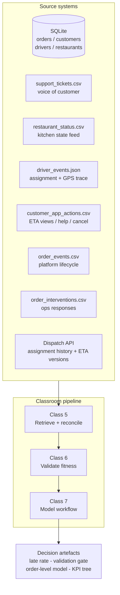

### Entity relationships

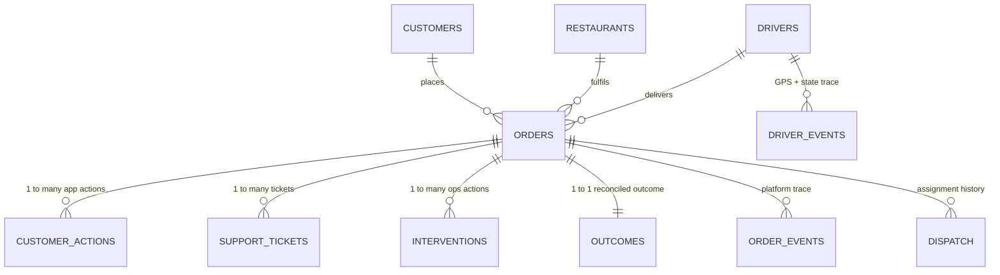

---

## Data Landscape

| Source | Grain | Volume | Authoritative for | Trust |
|---|---|---|---|---|
| `orders` (SQLite) | 1 row / order after dedup (raw has 3 dup order_ids) | 1603 rows, **1600 business orders** | Promised vs actual timestamps, final status | KPI basis |
| `order_outcomes.csv` | 1 row / order | 1600 | Reconciled late_flag / delay_min | KPI mirror |
| Dispatch API | 1 record / order | 1600 | Assignment history, reassignments, ETA version | Assignment truth |
| `support_tickets.csv` | 1 row / ticket | 202 (1 dup ticket_id, 3 null order_id) | Why it hurt (ETA churn, handoff failure) | Context, not sizing |
| `customer_app_actions.csv` | 1 row / action | 2365 | Customer friction signals | Behavioural |
| `order_interventions.csv` | 1 row / intervention | 430 | What ops tried | Response log |
| `restaurant_status.csv` | 1 row / status update | 502 | Kitchen state (with caveats) | Stale / semantic drift |
| `driver_events.json` | 1 row / ping-or-state | 120 drivers, ~10k events | Assignment / pickup / delivery facts | GPS is inference-only |
| `order_events` / `customer_interactions` | 1 row / event | 4955 / 497 | Lifecycle cross-checks | Corroboration |

---

## Class Journey

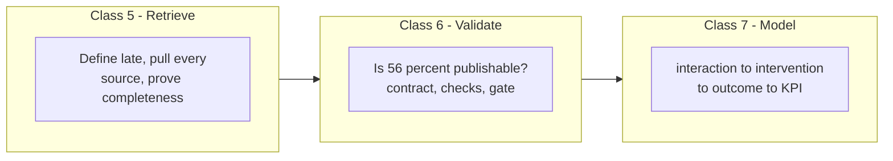

| Class | Question | Deliverable | Entry point |
|---|---|---|---|
| **5 — Investigation** | *How big is the late problem, and what is associated with it?* | Problem size + evidence + "would you build the AI predictor?" | `FlashEats_Class5_Student.ipynb` (`_Starter` for the blank version) |
| **6 — Validation** | *Can this data safely support the "56% late" decision?* | PASS / WARN / FAIL / UNKNOWN gate + publish verdict | `FlashEats_Class6_Student.ipynb` |
| **7 — Workflow modelling** | *Where does delay accumulate, how do customers react, what do interventions do?* | Order-level model + 5 metrics + KPI tree | `FlashEats_Class7_Challenge.ipynb` |
---

## Quickstart

### 1. Prerequisites

- Python **3.10+** (3.12 verified), `pip`, and Jupyter (`jupyter lab` / `notebook` / VS Code)
- About 50 MB disk (repo + venv excluded from git)

### 2. Clone and install

```bash
git clone https://github.com/akshat-code21/flasheats-classroom-pack.git
cd flasheats-classroom-pack

python3 -m venv venv && source venv/bin/activate   # Windows: venv\Scripts\activate
pip install -r api/requirements.txt
pip install jupyter pandas matplotlib seaborn requests flask
```

### 3. Start the mock Dispatch API (needed for Class 5, Challenge 4)

```bash
python api/mock_dispatch_api.py
# health check in another terminal:
curl "http://127.0.0.1:8000/health"
curl "http://127.0.0.1:8000/dispatch/orders?page=1&page_size=50"
```

> The API is **intentionally flaky**: page 3 fails once with HTTP 500, page 5 once with HTTP 429. The notebooks implement retry + raw-page preservation + count verification to survive it.

### 4. Run the notebooks

```bash
jupyter lab
# open in order:
# 1. FlashEats_Class5_Student.ipynb   (or _Starter for the exercise)
# 2. FlashEats_Class6_Student.ipynb
# 3. FlashEats_Class7_Challenge.ipynb
```

Or execute headlessly:

```bash
jupyter nbconvert --to notebook --execute FlashEats_Class5_Student.ipynb  --output /tmp/out5.ipynb --allow-errors
jupyter nbconvert --to notebook --execute FlashEats_Class6_Student.ipynb  --output /tmp/out6.ipynb --allow-errors
jupyter nbconvert --to notebook --execute FlashEats_Class7_Challenge.ipynb --output /tmp/out7.ipynb --allow-errors
```

All three execute with **0 errors**; Class 5 regenerates `student_output/raw_dispatch/page_*.json` (32 verified pages, git-ignored).

---

## Notebooks

### Class 5 — Investigation (`FlashEats_Class5_Student.ipynb`)

| Challenge | Task | Answer (headline) |
|---|---|---|
| 1 | Size the late problem (define, query, report) | **843 / 1495 = 56.4% late** (over 10 min: 23.3%; median late 8.0 min) |
| 2 | Test "traffic is the problem" on 3+ dimensions | Associated, not causal — severe/high + rain ride with delay |
| 3 | System view vs customer view from tickets | Tickets confirm real pain + add ETA-trust/handoff insight |
| 4 | Prove complete dispatch retrieval | 1600/1600 verified, 95 reassignments, raw pages saved |
| 5 | Observed vs inferred driver events | **No reliable arrival-at-restaurant event** — GPS is inference-only |
| Final | One-slide FDE recommendation | **Do not build the AI predictor yet** — fix definitions/instrumentation first |

### Class 6 — Validation (`FlashEats_Class6_Student.ipynb`)

| Challenge | Task | Verdict |
|---|---|---|
| 1 | Defend "56%"? (grain + chronology contract) | WARN — 3 dup orders, 37 unknown, 9 chronology violations |
| 2 | Stakeholders disagree on "late" | FAIL — over 0 min = 56.4% vs over 10 min = 23.3%, **no owner** |
| 3 | Categories without instinct-cleaning | FAIL — handoff/handed_off, unknown, 9 ticket variants need owners |
| 4 | Cross-source ID integrity | **PASS** — 100% key coverage |
| 5 | Freshness as SLA | PASS (weekly) / **FAIL (live ETA)** / WARN (accountability) |
| 6 | Publish gate | **DO NOT PUBLISH 56%** |

### Class 7 — Workflow model (`FlashEats_Class7_Challenge.ipynb`)

| Challenge | Task | Output |
|---|---|---|
| 1 | Reconstruct 3 order lifecycles | event_time / event_type / actor / source_system timelines |
| 2 | Canonical project model | customers 1-* orders 1-* actions/tickets/interventions, 1-1 outcomes |
| 3 | interaction to intervention to outcome table | 138 late+support; 430 intervened; 106 frustrated with no intervention |
| 4 | 3–5 business metrics | Late rate, frustrated rate, coverage, cancel rate, median late |
| 5 | Joins/aggregations A–E (assoc. != causation) | Support ~16.7 vs 1.7 min; interventions 0.564 vs 0.564 (triage bias) |
| 6 | KPI linkage | Controllable vs outcome metrics + #1 instrumentation gap |

---

## Mock Dispatch API

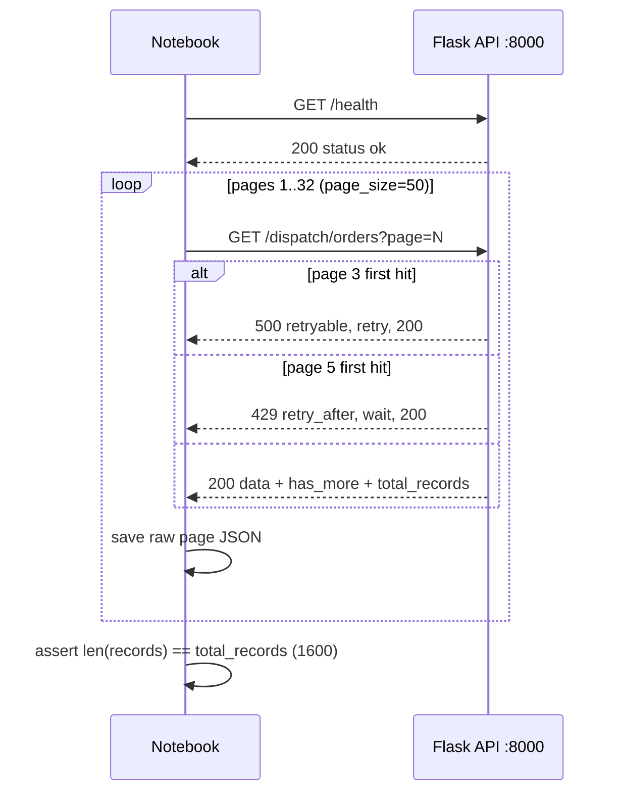

| Endpoint | Behaviour |
|---|---|
| `GET /health` | `{status: ok, service: flasheats-dispatch-api}` |
| `GET /dispatch/orders?page=&page_size=` | Paginated records + `has_more` + `total_records`; chaos on p3 (500) / p5 (429) first hit |
| `GET /dispatch/orders/<order_id>` | Single record or 404 |
---

## Key Findings (Completed Solutions)

All notebooks are **fully solved and executed** — headline numbers are consistent across classes:

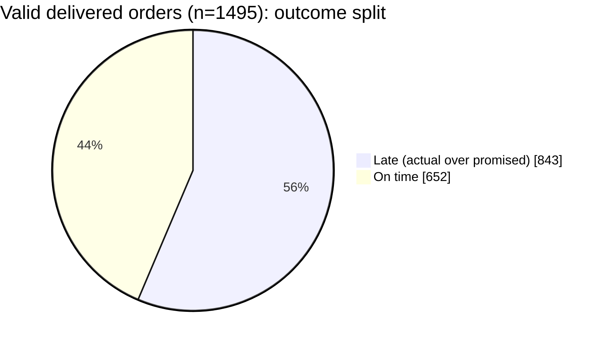

| Metric | Value | Definition |
|---|---|---|
| Valid delivered denominator | **1495** | Deduped orders, delivered (case-insensitive), non-null actual + promised |
| Late (any delay over 0) | **843 = 56.4%** | actual_delivery_at over promised_eta |
| Meaningfully late (over 10 min) | **23.3%** | Support Lead threshold — same denominator |
| Median lateness (late only) | **8.0 min** | Severity companion to the rate |
| Cancelled (excluded) | 68 | Never delivered — Finance agrees to exclude |
| Delivered but unknown | 37 | Null actual — counted as unknown, never as on-time |
| Duplicate business keys | 3 order_ids (6 rows) | Conflicting traffic_bucket — dedup before any cut |
| Ticketed orders skew | median **~14 min** | Customers feel real lateness |
| Dispatch reassignments | 95 / 1600 | driver_id != original_driver_id |
| ETA versions | 800 x v3.1 / 800 x v3.2 | Comparability unproven |

**Bottom line: do not build the AI delay predictor yet.** Lock one owned late definition, fix grain/casing/null rules, instrument arrival + handoff events, then re-validate — otherwise the model learns label noise and ETA distrust.

---

## Validation Gate (Class 6)

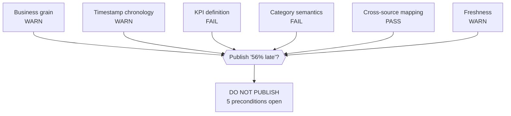

| Check | Status | Evidence | Action + Owner |
|---|---|---|---|
| Business grain | **WARN** | 3 dup order_ids, raw 1603 vs 1600 business orders | Dedup rule — Data Team |
| Timestamp chronology | **WARN** | 4 promised-before-created, 5 actual-before-pickup | Disposition — Data Team + Ops |
| KPI definition | **FAIL** | 56.4% vs 23.3%; no canonical owner | Sign threshold + population — **VP Ops (with Finance)** |
| Category semantics | **FAIL** | handoff/handed_off, unknown, 9 ticket variants | Taxonomy sign-off — Restaurant Ops + Support Lead |
| Cross-source mapping | **PASS** | 100% key coverage (3 null-order tickets disclosed) | None — monitor |
| Freshness | **WARN** | OK weekly / FAIL live ETA / WARN accountability | SLA per use case — Product + Ops |

Publish requires: (1) named KPI owner, (2) dedup + casing rules, (3) unknown/chronology disposition, (4) taxonomy sign-off, (5) freshness SLA.

---

## Business Workflow Model (Class 7)

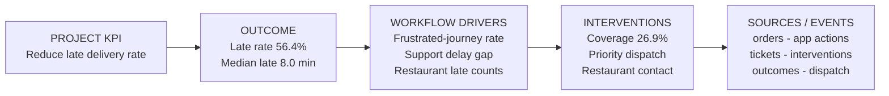

| # | Metric | Formula (order grain) | Type | Why it matters |
|---|---|---|---|---|
| 1 | Late Delivery Rate | mean(late_flag) over known outcomes | Outcome (KPI) | The project KPI itself |
| 2 | Frustrated-Journey Rate | P(support=1 late=1) about 16.4% | Interaction | Felt pain, not just minutes |
| 3 | Intervention Coverage | P(interventions over 0) about 26.9% | Intervention | Are rescues reaching at-risk orders? |
| 4 | Cancel-Attempt Rate | mean(cancel_attempted) (10 orders) | Interaction | Extreme-friction early warning |
| 5 | Median Delay Late | median(delay_min late) about 8 min | Outcome severity | Rate alone hides severity |

**Controllable by ops:** intervention targeting, restaurant-contact playbook, support response. **Outcomes:** late rate, median delay. **Biggest blind spot:** no restaurant-arrival event, so kitchen vs road delay cannot be split — instrument it first.
---

## Order Lifecycle

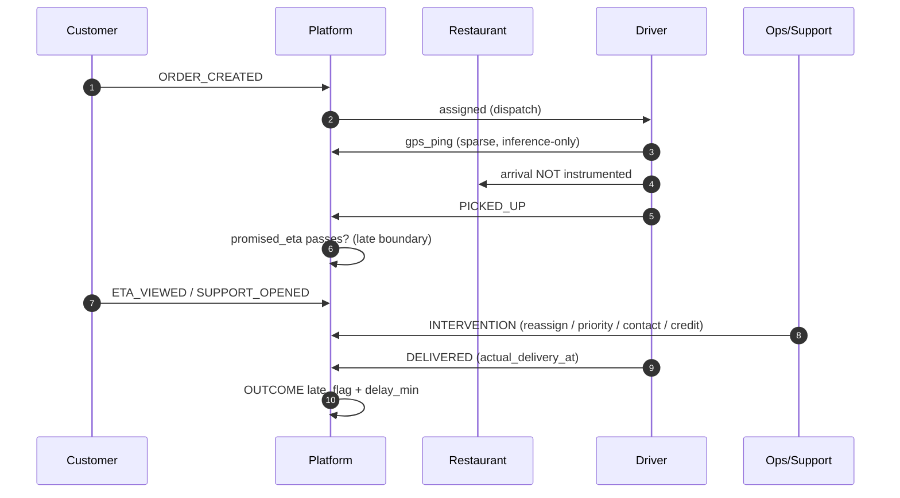

---

## Decision Logic

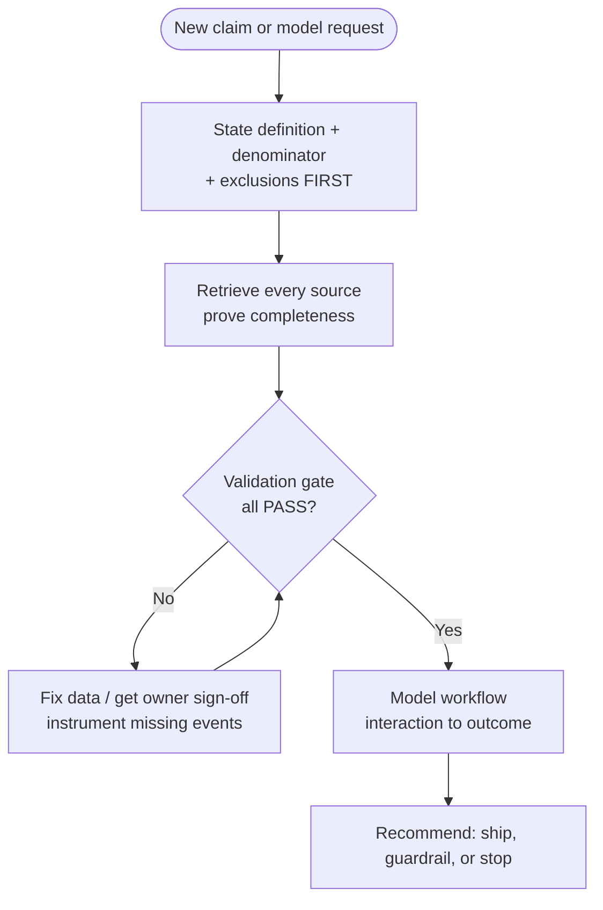

FDE rules honoured throughout: **no ML in the first 90 minutes, preserve raw API responses, never silently drop failures, state exclusions, association is not causation**.

---

## Known Data Quirks

Deliberately planted (and fully diagnosed in the notebooks) — do not "fix" them silently:

| Quirk | Where | Handling |
|---|---|---|
| 3 duplicate order_ids, conflicting traffic_bucket | orders | drop_duplicates(order_id), 1600 business grain |
| 'Delivered' (5) vs 'delivered' | orders.final_status | Case-insensitive normalisation (documented) |
| 'HIGH' (3) vs 'high' | orders.traffic_bucket | Lower-case after grain fix |
| 37 delivered with null actual_delivery_at | orders | Unknown bucket — excluded, disclosed |
| 4 x promised-before-created, 5 x actual-before-pickup | orders | Chronology violations — owner disposition |
| 1 dup ticket_id (T00013), 3 null-order_id tickets | support_tickets.csv | Dedup + disclose; left-join from orders |
| ready/Ready/READY/ready-space + handoff vs handed_off + unknown | restaurant_status.csv | Casing is representation (safe); rest is semantic (owner) |
| 9 ticket category variants | support_tickets.csv | Taxonomy needs Support Lead — never auto-merge |
| 14 x picked_up before assigned; sparse GPS, no geofence | driver_events.json | Arrival is uninferrable — instrument it |
| Flaky pages 3 (500) and 5 (429) | Dispatch API | Retry + raw preservation + count assert |

---

## Tech Stack

| Layer | Tool |
|---|---|
| Language | Python 3.10+ (3.12 verified) |
| Analysis | pandas, matplotlib, seaborn |
| API + retrieval | flask (mock), requests (retry client) |
| Store | SQLite (sqlite3) |
| Docs/diagrams | Markdown + **Mermaid** (renders natively on GitHub) |
| Execution | Jupyter (nbconvert --execute verified, 0 errors) |

---

## Contributing and Classroom Use

1. **Students:** start from `FlashEats_Class5_Starter.ipynb`, then compare against the completed `_Student` notebooks.
2. **Instructors:** the per-class briefs (`README_STUDENTS.md`, `README_CLASS6.md`, `README_CLASS7.md`) and `manifest*.json` files are preserved untouched.
3. Keep `venv/`, `student_output/`, `__pycache__/`, and `.ipynb_checkpoints/` out of commits (see `.gitignore`).
4. If your team gets a different "56%" — investigate **definitions and grain first**, per the FDE rules. That is the lesson.

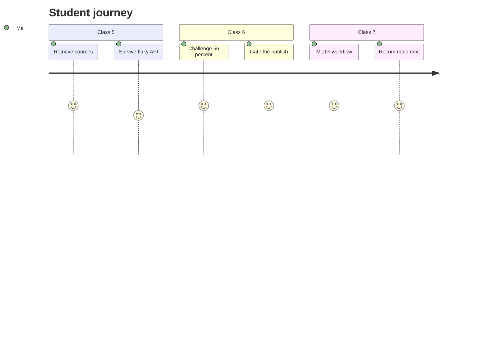

---

## License / Attribution

Classroom materials for FDE-style data investigation practice. Fictional dataset (`FlashEats`) — any resemblance to real orders is coincidental. Upstream: `manangupta12/flasheats-classroom-pack`; this fork adds **completed, executed solutions for all challenges in all four notebooks** plus this README.

> *"The data shows delay; the tickets show distrust; the traces show what we still cannot see. We cannot determine causation from association — we would need arrival instrumentation and an owned late definition before concluding anything, let alone training a predictor."*
